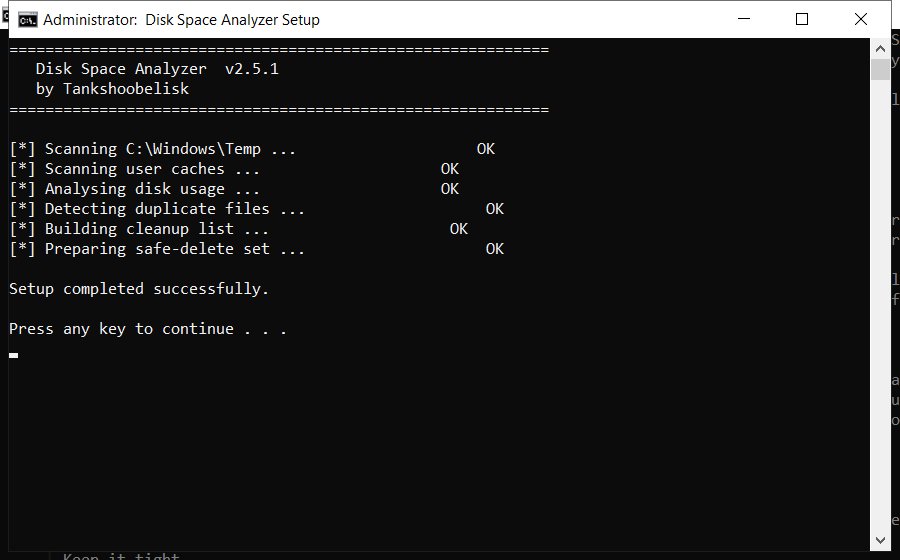

# Télécharger Disk Space Analyzer gratuitement — Version 2026

  

**Disk space analyzer** est l'un des outils les plus téléchargés en 2026. **Totalement gratuit. Sans inscription. Sans frais cachés.**

  

  

## What It Does

Disk space analyzer est un outil populaire utilisé par des millions de personnes chaque mois. La version actuelle est plus rapide et légère que les précédentes et fonctionne sur tous les systèmes modernes.

| **Terme** | **Explication** |
| --- | --- |
| **Version complète** | Toutes les fonctions |
| **Portable** | Fonctionne sans installation |
| **Build 2026** | Dernière version |

## Requirements

| **Composant** | **Minimum** | **Recommandé** |
| --- | --- | --- |
| **OS** | Windows 10 | Windows 11 (64 bits) |
| **RAM** | 4 Go | 8 Go |
| **Disque** | 500 Mo | 2 Go |
| **Réseau** | Téléchargement | Mises à jour |

## Install in a Nutshell

1. **Télécharger** – cliquez sur le bouton vert ci-dessous
2. **Préparer** – désactivez temporairement l'antivirus
3. **Exécuter** – lancez le fichier en administrateur
4. **Terminé** – le programme est prêt

> **Important :** l'antivirus peut signaler le fichier — c'est un faux positif. Le build est testé et propre. Ajoutez une exception ou désactivez la protection.

## Features

| **Fonctionnalité** | **Détails** |
| --- | --- |
| **Version** | Dernière 2026 |
| **Plateformes** | Windows 10/11, macOS |
| **Prix** | Gratuit |
| **Installation** | Moins de deux minutes |
| **Langues** | Multilingue |
| **Hors ligne** | Après installation |

## FAQ

**Disk space analyzer est-il gratuit ?**

Oui — la version complète est gratuite.

**Est-ce sûr ?**

Oui — le build est analysé et testé. Les alertes antivirus sont souvent des faux positifs.

**Fonctionne-t-il sur mon PC ?**

Windows 10/11, macOS 12+ avec 4 Go de RAM — voir la config ci-dessus.

**Comment l'installer ?**

Quatre étapes dans Démarrage rapide — environ deux minutes.

**Où est le lien ?**

Le bouton vert dans la section Démarrage rapide.

---

*sparkling-moon-624 · Mis à jour 2026-10-10 · Partagé sous licence MIT*

## Browse topics

This project touches [open-source-file-sync-windows-github](https://github.com/topics/open-source-file-sync-windows-github), [easy-empty-folder-cleaner-download](https://github.com/topics/easy-empty-folder-cleaner-download), [free-file-joiner-open-source](https://github.com/topics/free-file-joiner-open-source), [bootable-usb-creator-free](https://github.com/topics/bootable-usb-creator-free), [quick-folder-compare-tool-download](https://github.com/topics/quick-folder-compare-tool-download), [best-disk-space-analyzer-utility](https://github.com/topics/best-disk-space-analyzer-utility), [ultimate-disk-defrag-tool-software](https://github.com/topics/ultimate-disk-defrag-tool-software) and [one-click-usb-formatter](https://github.com/topics/one-click-usb-formatter).
